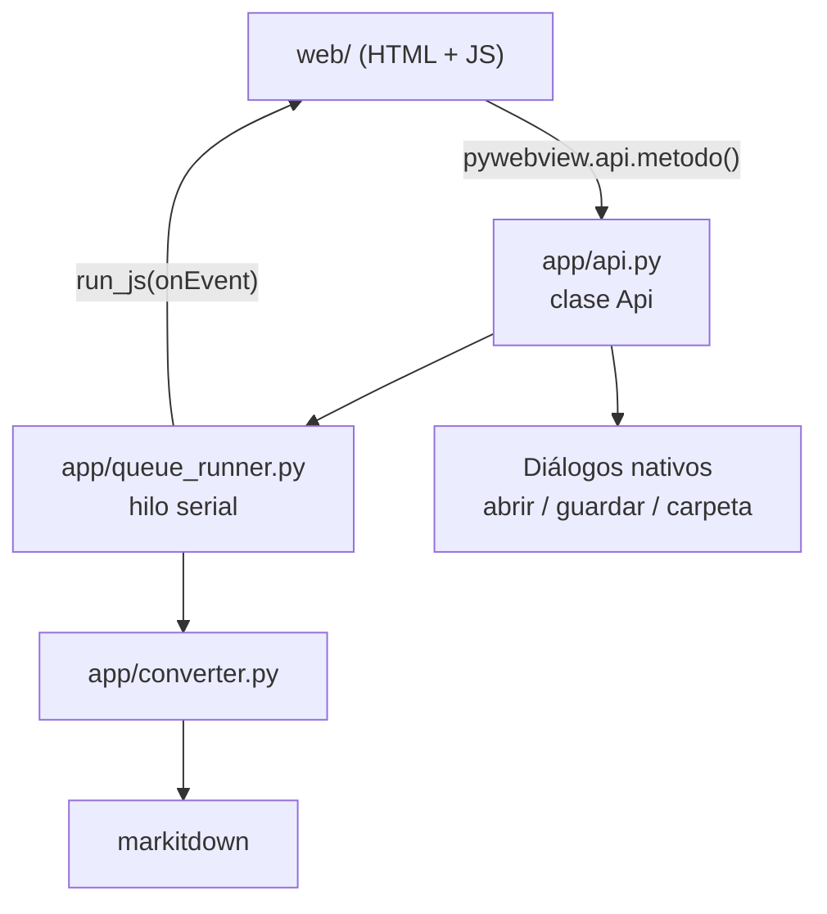
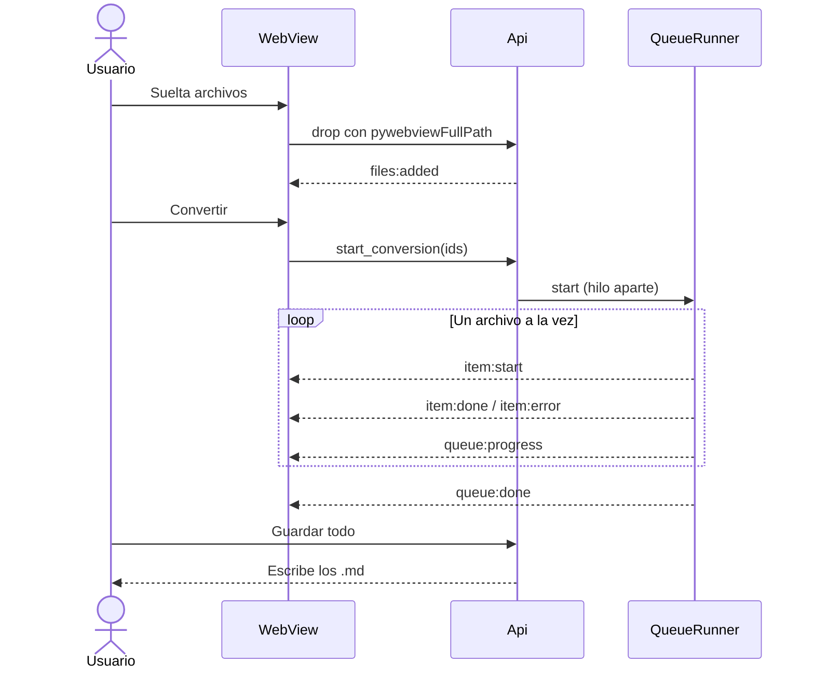

# ToMarkdown

App de escritorio nativa que convierte documentos a Markdown usando
[microsoft/markitdown](https://github.com/microsoft/markitdown).

Se instala, se abre con doble clic y se usa sin terminal, sin navegador y sin
conexión a internet. Arrastras archivos, ves la cola convertirse uno por uno y
guardas los `.md` donde quieras.

> [!NOTE]
> No es un servicio web. No hay backend HTTP propio, ni puertos expuestos hacia
> afuera, ni telemetría. Todo ocurre en tu máquina.

---

## Índice

- [Formatos soportados](#formatos-soportados)
- [Instalación](#instalación)
- [Cómo funciona](#cómo-funciona)
- [Desarrollo](#desarrollo)
- [Empaquetado](#empaquetado)
- [Decisiones técnicas](#decisiones-técnicas)
- [Fuera de alcance](#fuera-de-alcance)

Documentación técnica más a fondo en [`docs/`](docs/index.md): la
[arquitectura](docs/arquitectura/overview.md) y el
[contrato de la API](docs/arquitectura/contrato-api.md).

---

## Formatos soportados

| Categoría | Extensiones |
|---|---|
| Documentos | `pdf`, `docx`, `epub` |
| Presentaciones | `pptx` |
| Hojas de cálculo | `xlsx`, `xls` |
| Correo | `msg` |
| Web y datos | `html`, `htm`, `xml`, `json`, `csv` |
| Texto | `txt`, `md`, `markdown` |
| Otros | `ipynb`, `zip` |

La lista viva vive en `SUPPORTED_EXTENSIONS`, dentro de
[`app/config.py`](app/config.py). El front la pide al arrancar, así que agregar
un formato es tocar un solo diccionario.

---

## Instalación

Descarga el archivo de tu plataforma desde la
[página de releases](https://github.com/YERCKEN/tomarkdown/releases).

### macOS

Descomprime y arrastra `ToMarkdown.app` a `Aplicaciones`.

> [!IMPORTANT]
> El `.app` no está firmado con una cuenta de desarrollador de Apple, así que la
> primera vez macOS muestra *«no se puede abrir porque proviene de un
> desarrollador no identificado»*.

Para abrirlo la primera vez, cualquiera de las dos:

1. **Clic derecho** sobre `ToMarkdown.app` → **Abrir** → **Abrir** en el diálogo.
   A partir de ahí funciona con doble clic normal.
2. O quitar la marca de cuarentena desde la terminal:

   ```bash
   xattr -dr com.apple.quarantine /Applications/ToMarkdown.app
   ```

### Windows

Descomprime y ejecuta `ToMarkdown.exe`. SmartScreen puede avisar por ser un
binario sin firmar: **Más información** → **Ejecutar de todas formas**.

### Verificar que la instalación quedó completa

El ejecutable acepta `--self-check`: convierte una muestra sin abrir la ventana
y sale con código 0 si el empaquetado está bien.

```bash
# macOS
/Applications/ToMarkdown.app/Contents/MacOS/ToMarkdown --self-check

# con tus propios archivos
/Applications/ToMarkdown.app/Contents/MacOS/ToMarkdown --self-check informe.pdf notas.docx
```

En Windows el ejecutable es de tipo ventana y no escribe en consola: ahí solo
cuenta el código de salida (`echo $LASTEXITCODE`).

---

## Cómo funciona

Cuatro piezas y un puente. No hay HTTP entre el front y la lógica: pywebview
expone la clase `Api` directamente al JavaScript.



El flujo completo, desde soltar un archivo hasta guardarlo:



### Sobre el progreso

markitdown no expone progreso interno de conversión: no hay forma de saber que
un PDF va por el 40%.

- **La barra general es real y determinada**: `convertidos / total`.
- **El archivo activo usa animación indeterminada**: la fila misma se llena con
  un lavado rojo tenue que barre en loop. Nunca un porcentaje falso ni un
  temporizador simulado.

Con `prefers-reduced-motion` activo, el barrido se reemplaza por un punto rojo
fijo.

---

## Desarrollo

Requisitos: [uv](https://docs.astral.sh/uv/), Python 3.12 y Node solo si vas a
tocar el CSS.

### Ejecutar la app

**Desde la terminal:**

1. Instala las dependencias de Python. Una sola vez: crea `.venv/` con todo.

   ```bash
   uv sync --extra dev
   ```

2. Abre la ventana.

   ```bash
   uv run python -m app.main
   ```

Para depurar, `TOMARKDOWN_DEBUG=1` activa las devtools del WebView y sube el log
a nivel `DEBUG`:

```bash
TOMARKDOWN_DEBUG=1 uv run python -m app.main
```

**Desde VSCode:**

1. Acepta la extensión **Python** (`ms-python.python`) que VSCode ofrece al
   abrir el proyecto —la sugiere `.vscode/extensions.json`—.
2. Corre `uv sync --extra dev` una vez. La extensión toma `.venv/` sola como
   intérprete.
3. **F5**. `.vscode/launch.json` trae dos configuraciones: **ToMarkdown** y
   **ToMarkdown (debug WebView)**, esta última con `TOMARKDOWN_DEBUG=1`.

> [!NOTE]
> Corriendo desde el código la app se ejecuta bajo el intérprete de Python, así
> que el Dock y el Finder la muestran como «Python». El icono y el nombre
> propios solo aplican al binario empaquetado: ver
> [Cambiar el icono de la app](docs/guias/cambiar-el-icono.md).

### Front

`web/dist/output.css` y `web/fonts/` **se versionan**, para que empaquetar no
dependa de tener Node instalado. Solo hace falta regenerarlos si tocas el CSS:

```bash
npm install
npm run fonts        # copia los woff2 de @fontsource a web/fonts/
npm run css          # compila Tailwind v4
npm run css:watch    # el anterior, en modo watch
```

### Pruebas

`pytest`, sin GUI, deterministas. Corren en CI antes de empaquetar.

```bash
uv run pytest              # todo
uv run pytest -k queue     # por nombre
```

`tests/` cubre el convertidor (traducción de errores y conversión real formato
por formato, con un PDF roto a propósito), el hilo de la cola (`QueueRunner`:
orden serial, un error que no la detiene, cancelación limpia) y los helpers
puros de `api.py` y `config.py`.

Aparte, el ejecutable acepta `--self-check`: convierte una muestra sin abrir la
ventana. Sirve para verificar un bundle ya empaquetado (ver
[Empaquetado](#empaquetado)).

El detalle —fixtures, cómo correr un solo caso, cómo agregar un test— está en
[Pruebas](docs/guias/pruebas.md).

### Estructura

```
app/
├── config.py        # nombre, versión, tamaños, extensiones. Fuente única.
├── converter.py     # envoltorio de markitdown y traducción de errores
├── queue_runner.py  # hilo serial y emisión de eventos
├── api.py           # superficie expuesta al JavaScript
└── main.py          # ventana, arranque y --self-check
tests/               # pytest: un test_<módulo>.py por módulo de app/
web/
├── index.html
├── app.js           # todo el estado en un solo objeto
├── src/input.css    # fuente de Tailwind
├── dist/output.css  # compilado, versionado
└── fonts/           # woff2 self hosted
```

---

## Empaquetado

```bash
uv run pyinstaller --noconfirm build.spec
```

| Plataforma | Modo | Salida |
|---|---|---|
| macOS | one folder dentro de un `.app` | `dist/ToMarkdown.app` |
| Windows | one file | `dist/ToMarkdown.exe` |

Para reemplazar el icono por defecto de PyInstaller por uno propio, ver
[Cambiar el icono de la app](docs/guias/cambiar-el-icono.md).

> [!WARNING]
> PyInstaller no hace cross compile. El `.app` solo sale desde macOS y el `.exe`
> solo desde Windows. Por eso el workflow de CI usa una matriz con los dos
> runners y se dispara con cada tag `v*`.

### Sobre el tamaño

El `.app` de macOS pesa unos **161 MB** (65 MB comprimido). No es margen que se
pueda recortar mucho:

- markitdown depende de `magika` en su núcleo, que trae un modelo ONNX y
  `onnxruntime` para detectar tipos de archivo.
- Los extras `xlsx` y `xls` arrastran `pandas` y `numpy`.

Se instalan extras acotados (`pdf,docx,pptx,xlsx,xls,outlook`) en vez de `[all]`,
que sumaría audio y transcripción, y `build.spec` excluye `tkinter`,
`matplotlib`, notebooks y las librerías de transcripción.

---

## Decisiones técnicas

<details>
<summary><b>Por qué el arrastre funciona con rutas reales</b></summary>

El objeto `File` del DOM no expone la ruta en disco por seguridad del navegador.
pywebview resuelve esto del lado nativo: al suscribirse al evento `drop` desde
Python, cada archivo llega con `pywebviewFullPath`.

```python
window.dom.document.events.drop += DOMEventHandler(api.on_native_drop, True, True)
```

Verificado contra pywebview 6.2.1 (`webview/util.py`). El camino alternativo
—leer los bytes con `FileReader` en JS, escribirlos a un temporal y usar
`convert_stream()`— **no hace falta** y no está implementado.

El `dragover` del documento hace `preventDefault()` tanto en el handler de
Python como en JS: sin eso, el WebView abre el archivo soltado y el usuario se
sale de la aplicación.

</details>

<details>
<summary><b>Por qué la conversión corre en un hilo</b></summary>

En el hilo principal congelaría la ventana entera. El hilo empuja eventos al
front con `window.run_js()`, que ejecuta el JavaScript sin envoltorio `eval` y
no devuelve valor — justo lo que corresponde llamar desde un hilo secundario.

El enlace de los eventos de arrastre se hace en `window.events.loaded` y no en
el callable de `webview.start()`: ese corre apenas arranca el proceso, antes de
que exista el WebView, y `window.dom` necesita evaluar JavaScript.

</details>

<details>
<summary><b>Por qué hay un servidor en 127.0.0.1</b></summary>

pywebview levanta un servidor bottle interno en `127.0.0.1` con un puerto
efímero para servir los archivos locales del front. Es el camino que recomienda
su documentación; cargar por `file://` está explícitamente desaconsejado por las
limitaciones de acceso a recursos locales en WKWebView y WebView2.

Solo escucha en loopback, no acepta conexiones desde fuera de la máquina y la
app sigue funcionando con el wifi apagado. No hay backend propio: ni FastAPI, ni
CORS, ni endpoints. La comunicación entre el front y Python va por el puente
`js_api`, no por HTTP.

</details>

<details>
<summary><b>Por qué la conversión es serial</b></summary>

markitdown puede ser pesado en memoria con PDFs grandes, y la cola se lee mejor
avanzando en orden que con cinco barras compitiendo. Cada archivo va dentro de
su propio `try/except`: uno corrupto se marca en error con un mensaje legible y
la cola sigue.

</details>

---

## Fuera de alcance

Anotado a propósito, para no meterlo sin querer:

- Preview del Markdown convertido
- Plugins de markitdown y OCR con LLM
- Conversión de URLs y YouTube
- Historial de conversiones
- Auto update
- Configuración persistente

---

## Licencia

El código de ToMarkdown está bajo **MIT** (ver [`LICENSE`](LICENSE)). Se puede
usar, modificar, redistribuir y publicar sin pedir permiso.

### Dependencias

[microsoft/markitdown](https://github.com/microsoft/markitdown) y el resto de las
librerías de Python son todas de licencia permisiva (MIT, BSD, Apache-2.0, PSF).
Ninguna obliga a que ToMarkdown sea open source ni impone condiciones a su
distribución, más allá de mantener sus avisos de copyright.

El binario empaquetado **incluye** esas librerías, así que trae un
`THIRD-PARTY-LICENSES.md` con el aviso de cada una. Ese archivo lo genera
`build.spec` al empaquetar (con `scripts/gen_licenses.py`) y no se versiona.

### Assets del front

Van inline en el repo, porque la app tiene que funcionar sin conexión.

| Recurso | Dónde | Licencia |
|---|---|---|
| Iconos de [Lucide](https://lucide.dev) | `web/icons.js` | ISC |
| [Marca de Markdown](https://github.com/dcurtis/markdown-mark) | `web/icons.js`, `assets/icon.svg` | CC0 1.0 |
| [Inter](https://rsms.me/inter/), [Space Grotesk](https://fonts.floriankarsten.com/space-grotesk), [JetBrains Mono](https://www.jetbrains.com/lp/mono/) | `web/fonts/` | SIL OFL 1.1 |
