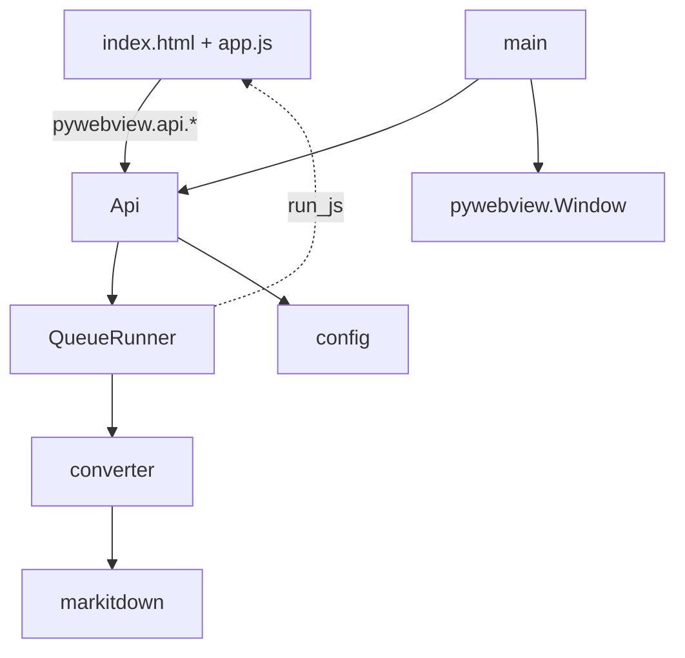
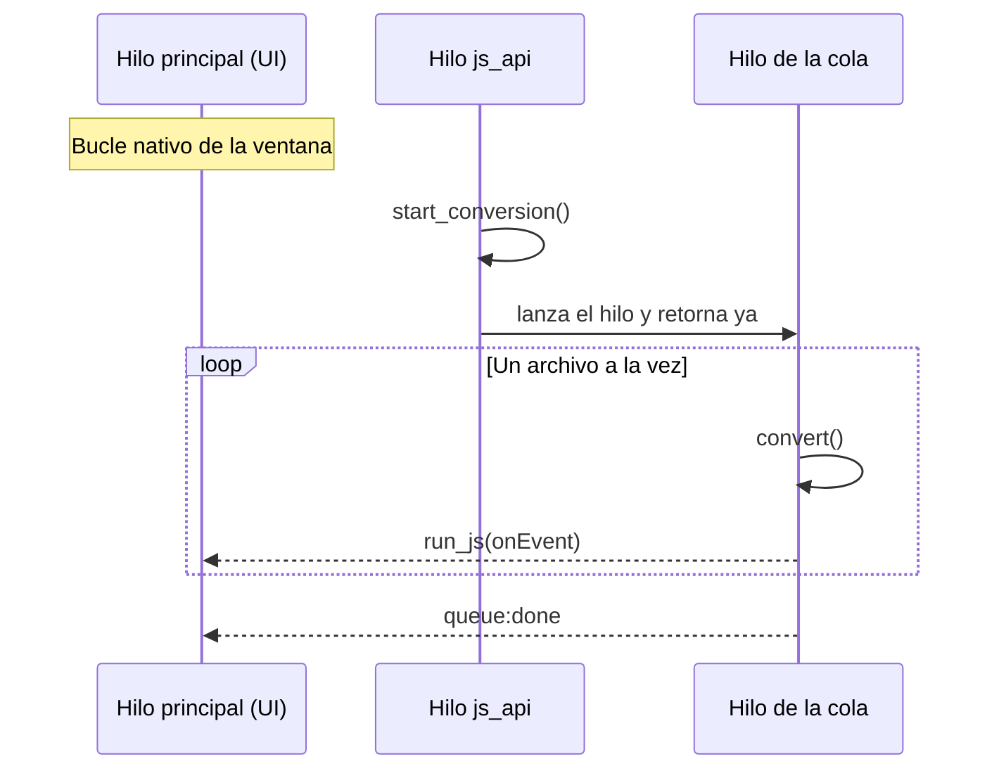
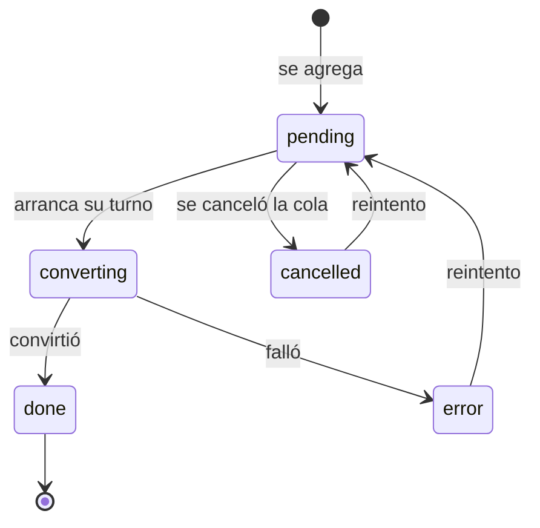

# Arquitectura

ToMarkdown es una app de escritorio de una sola ventana. No hay servidor propio,
ni framework de front, ni proceso aparte: un proceso de Python que abre un
WebView nativo y le expone una clase.

---

## Las piezas

| Módulo | Responsabilidad |
|---|---|
| `app/config.py` | Nombre, versión, tamaños y extensiones. **Fuente única de verdad**: lo leen `main.py`, `api.py`, `build.spec` y `pyproject.toml`. |
| `app/converter.py` | Único punto que conoce markitdown. Traduce excepciones a mensajes en español. |
| `app/queue_runner.py` | Hilo de conversión serial y emisión de eventos. |
| `app/api.py` | Superficie expuesta al JavaScript. Dueña del estado de la cola. |
| `app/main.py` | Crea la ventana, enlaza el arrastre nativo y ofrece `--self-check`. |

> [!IMPORTANT]
> El Markdown convertido **no viaja al front**. Vive en memoria del lado Python,
> indexado por `id`. Un PDF grande convertido puede ser de varios MB de texto y
> el front no lo necesita mientras no exista un preview.

---

## Modelo de hilos

Tres hilos, con reglas claras sobre quién puede hacer qué.

| Hilo | Qué corre ahí | Regla |
|---|---|---|
| Principal | El bucle de la ventana | Nunca se le da trabajo pesado: bloquearlo congela la app entera. |
| `js_api` | Cada método de `Api` que llama el front | pywebview los ejecuta en hilos propios. `start_conversion` retorna de inmediato. |
| Cola | `QueueRunner._run` | Convierte y empuja eventos con `run_js`. |

### Por qué `run_js` y no `evaluate_js`

`evaluate_js` envuelve el código en `eval` y devuelve el resultado; con
`callback` da problemas desde hilos secundarios. `run_js` ejecuta el JavaScript
tal cual y no devuelve nada, que es exactamente lo que hace falta para empujar
un evento desde el hilo de la cola.

### Por qué el arrastre se enlaza en `loaded`

Suscribir los eventos del DOM desde el callable que recibe `webview.start()`
falla: ese corre en un hilo apenas arranca el proceso, antes de que exista el
WebView, y `window.dom` necesita evaluar JavaScript. El síntoma es
`WebViewException: Main window failed to start`.

El enlace va en `window.events.loaded`. pywebview pasa la ventana a los handlers
cuyo parámetro se llame literalmente `window`.

---

## Por qué la conversión es serial

No es una limitación pendiente de resolver, es una decisión:

1. markitdown puede ser **pesado en memoria** con PDFs grandes. Cinco en
   paralelo multiplican el pico.
2. La cola **se lee mejor** avanzando en orden que con cinco barras compitiendo.
3. markitdown **no expone progreso interno**, así que el paralelismo tampoco
   compraría una barra más informativa.

Cada archivo va dentro de su propio `try/except`: uno corrupto se marca en
error con un mensaje legible y la cola sigue con el siguiente.

---

## Estado y su única dirección

El store de Python es el dueño del estado; el front mantiene una copia que se
actualiza **solo** por eventos. En el front, todo vive en un único objeto
`state` y el DOM se deriva de él, nunca al revés.

---

Anterior: [Índice](../index.md) · Siguiente: [Contrato de la API](contrato-api.md)
