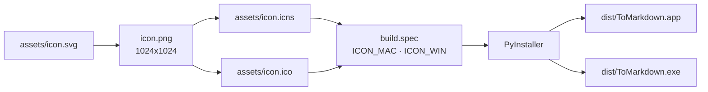

# Cambiar el icono de la app

El repo ya trae un icono: `assets/icon.svg` (la marca de Markdown en blanco
sobre el rojo de marca, la misma del header), y sus binarios `assets/icon.icns`
y `assets/icon.ico`. Esta guía explica cómo cambiarlo o regenerarlo.

---

## Antes de empezar

El icono propio **solo aplica al binario empaquetado** (`dist/ToMarkdown.app` y
`dist/ToMarkdown.exe`).

Corriendo desde el código (`uv run python -m app.main` o F5 en VSCode) la app se
ejecuta bajo el intérprete de Python, así que el sistema la identifica como
«Python» y muestra su icono. Eso no se puede cambiar sin empaquetar.

`build.spec` toma los archivos de icono **solo si existen**: sin `assets/` el
build sigue funcionando con el icono por defecto.



---

## 1. Preparar los archivos

El diseño vive en `assets/icon.svg`. Editalo ahí (o partí de un **PNG cuadrado
de 1024×1024**) y de ahí salen los dos binarios.

### SVG → PNG de 1024

En macOS, sin instalar nada, con Quick Look:

```bash
qlmanage -t -s 1024 -o . assets/icon.svg   # produce icon.svg.png
mv icon.svg.png icon.png
```

Alternativa multiplataforma: abrir el SVG en el navegador y exportar, o
cualquier conversor SVG→PNG.

### macOS — `assets/icon.icns`

`iconutil` arma el `.icns` a partir de una carpeta `.iconset` con todas las
resoluciones:

```bash
mkdir icon.iconset
sips -z 16 16     icon.png --out icon.iconset/icon_16x16.png
sips -z 32 32     icon.png --out icon.iconset/icon_16x16@2x.png
sips -z 32 32     icon.png --out icon.iconset/icon_32x32.png
sips -z 64 64     icon.png --out icon.iconset/icon_32x32@2x.png
sips -z 128 128   icon.png --out icon.iconset/icon_128x128.png
sips -z 256 256   icon.png --out icon.iconset/icon_128x128@2x.png
sips -z 256 256   icon.png --out icon.iconset/icon_256x256.png
sips -z 512 512   icon.png --out icon.iconset/icon_256x256@2x.png
sips -z 512 512   icon.png --out icon.iconset/icon_512x512.png
cp icon.png       icon.iconset/icon_512x512@2x.png

iconutil -c icns icon.iconset -o assets/icon.icns
rm -r icon.iconset
```

`sips` e `iconutil` vienen con macOS, no hace falta instalar nada.

### Windows — `assets/icon.ico`

El `.ico` tiene que ser **multi-resolución** (de 16 a 256 px). Con
[ImageMagick](https://imagemagick.org):

```bash
magick icon.png -define icon:auto-resize=256,128,64,48,32,16 assets/icon.ico
```

Sin ImageMagick, sirve cualquier conversor PNG→ICO que conserve las resoluciones
intermedias.

> [!NOTE]
> No hace falta generar los dos en la misma máquina. PyInstaller no hace cross
> compile igual (el `.app` sale de macOS y el `.exe` de Windows), así que cada
> icono se usa donde corresponde y el que falte simplemente se ignora.

---

## 2. Reempaquetar

```bash
uv run pyinstaller --noconfirm build.spec
```

`build.spec` detecta `assets/icon.icns` / `assets/icon.ico` y se los pasa a
PyInstaller (`ICON_MAC` en el `BUNDLE` de macOS, `ICON_WIN` en el `EXE` de
Windows). En macOS también escribe `CFBundleIconFile` en el `Info.plist`.

---

## 3. Verificar

- **macOS**: revisar `dist/ToMarkdown.app` en el Finder.
- **Windows**: revisar `dist/ToMarkdown.exe` en el Explorador. La barra de título
  de la ventana toma el mismo icono.

---

## Si macOS no refresca el icono

macOS cachea los iconos con agresividad. Después de reempaquetar:

```bash
touch dist/ToMarkdown.app
killall Dock
killall Finder
```

Si aun así no cambia, moverlo a `Aplicaciones` y volver a abrirlo desde ahí
suele forzar la actualización.

---

## Licencia del icono actual

La marca de Markdown es de [dcurtis/markdown-mark](https://github.com/dcurtis/markdown-mark),
**CC0 1.0** (dominio público, sin atribución obligatoria). Se puede usar como
icono de la app sin problema. Si la reemplazás por otro diseño, revisá su
licencia.

---

Anterior: [Índice](../index.md) · Siguiente: [Pruebas](pruebas.md)
