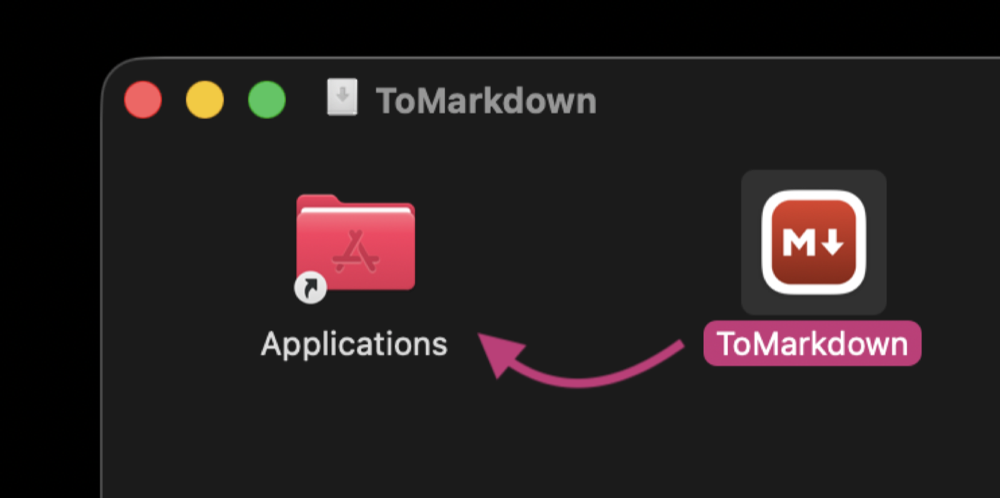
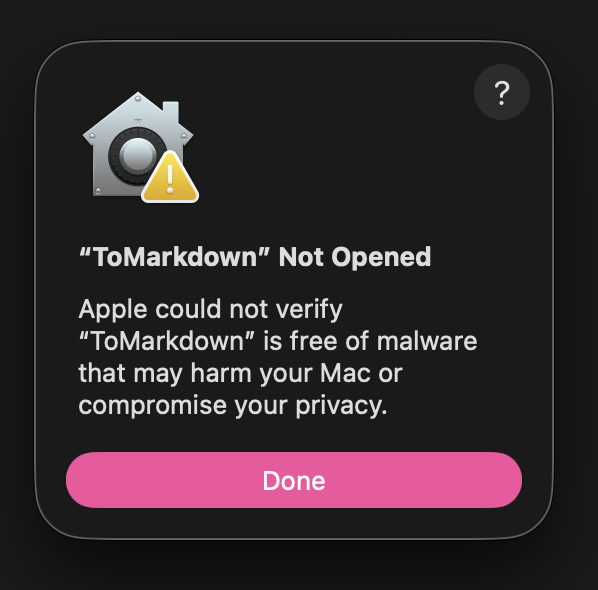
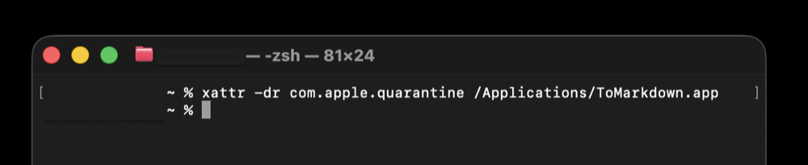
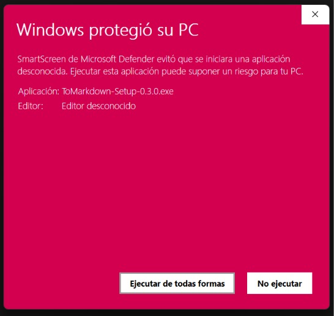
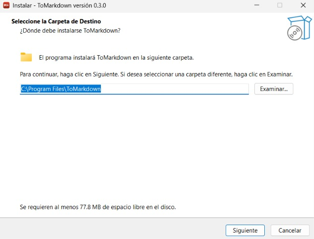
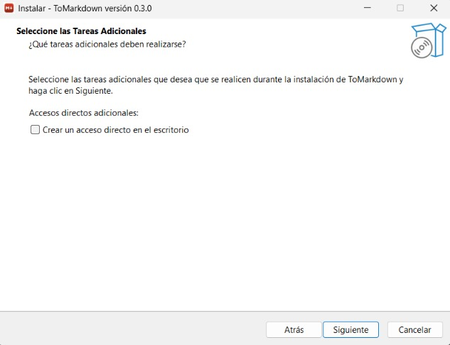
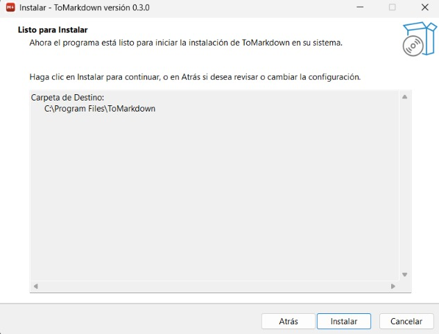
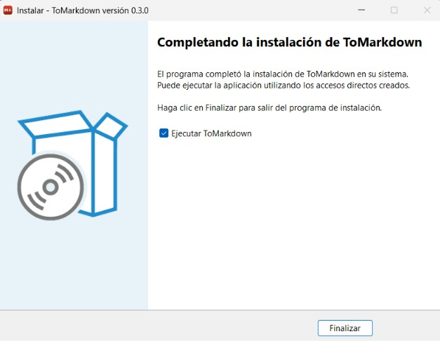
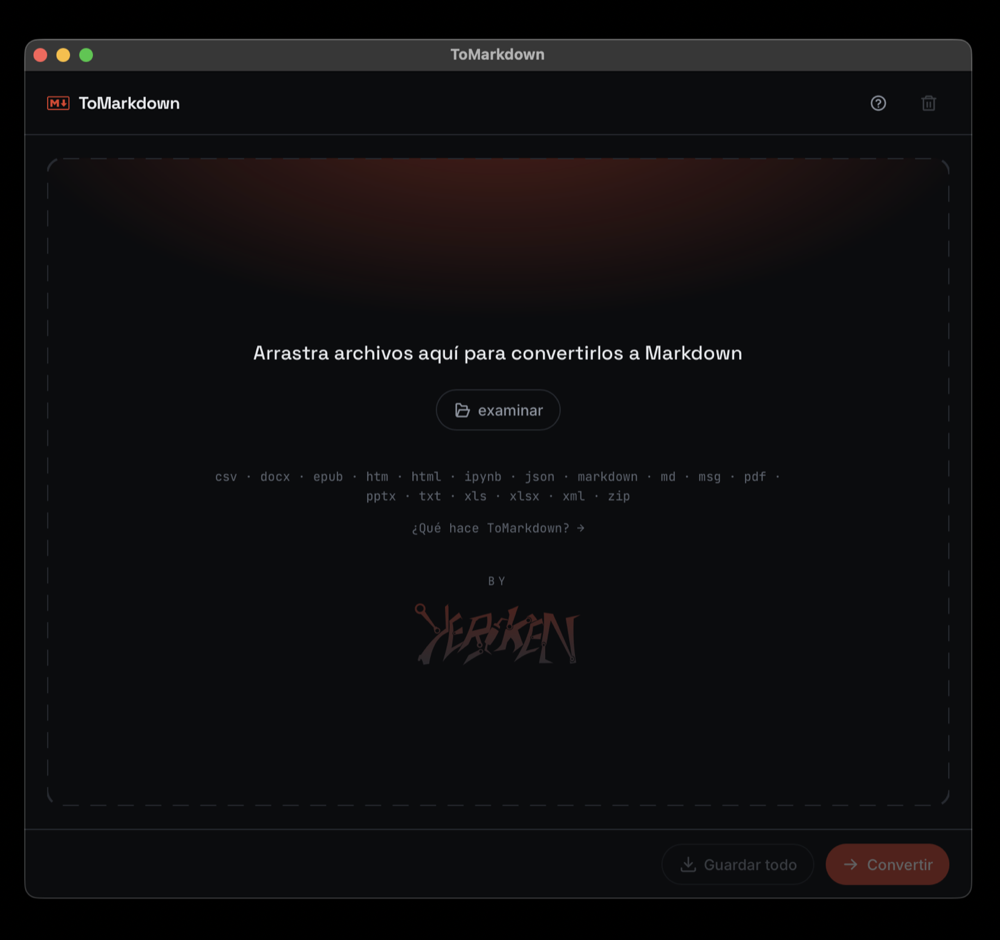

# Instalar ToMarkdown

Descargá el archivo de tu plataforma desde la
[página de releases](https://github.com/YERCKEN/tomarkdown/releases) y seguí los
pasos de abajo. La app no necesita Python, terminal ni conexión: se instala y se
abre con doble clic.

El binario **no está firmado** con una cuenta de desarrollador (ni de Apple ni
de Microsoft), así que la primera vez el sistema operativo avisa. Es esperado;
abajo está cómo seguir en cada caso.

---

## macOS

> [!IMPORTANT]
> El binario es solo para **Mac con Apple Silicon** (M1 o posterior). No hay
> build para Intel.

### 1. Montar el `.dmg` y arrastrar a Aplicaciones

Abrí `ToMarkdown-x.y.z.dmg`. La ventana trae `ToMarkdown.app` y un alias a
`Aplicaciones`: arrastrá el primero sobre el segundo.



### 2. Primera apertura

Al abrirlo por primera vez, macOS lo bloquea porque «no puede verificar que esté
libre de malware».



Para saltarlo, cualquiera de las dos:

1. **Clic derecho** sobre `ToMarkdown.app` en Aplicaciones → **Abrir** →
   **Abrir** en el diálogo. A partir de ahí funciona con doble clic normal.
2. O quitar la marca de cuarentena desde la terminal:

   ```bash
   xattr -dr com.apple.quarantine /Applications/ToMarkdown.app
   ```

   

### 3. Verificar que quedó completa

El ejecutable acepta `--self-check`: sin abrir la ventana, comprueba que los
componentes de los conversores están en el paquete y convierte una muestra. Sale
con código 0 si todo está bien.

```bash
/Applications/ToMarkdown.app/Contents/MacOS/ToMarkdown --self-check

# o con tus propios archivos / una carpeta
/Applications/ToMarkdown.app/Contents/MacOS/ToMarkdown --self-check informe.pdf notas.docx
```

---

## Windows

Dos opciones:

- **Instalador** (`ToMarkdown-Setup-x.y.z.exe`): instala en Archivos de
  programa, agrega acceso en el menú inicio y un desinstalador.
- **Portable** (`ToMarkdown-x.y.z-portable.zip`): descomprimí y ejecutá
  `ToMarkdown.exe`, sin instalar nada.

### Con el instalador

**1. SmartScreen.** Al ejecutar el `.exe`, Windows avisa que es una app
desconocida: **Más información** → **Ejecutar de todas formas**.



**2. Carpeta de destino.** Por defecto `C:\Program Files\ToMarkdown`.



**3. Acceso directo.** Opcional: crear uno en el escritorio.



**4. Instalar.** Revisá el resumen y confirmá.



**5. Finalizar.** Dejá tildado «Ejecutar ToMarkdown» para abrirlo al terminar.



Para desinstalar: **Configuración → Aplicaciones → Aplicaciones instaladas →
ToMarkdown → Desinstalar**. Se va limpio, sin dejar carpeta ni accesos.

### Con el portable

Descomprimí `ToMarkdown-x.y.z-portable.zip` y ejecutá `ToMarkdown.exe`. La
primera vez SmartScreen avisa igual (**Más información → Ejecutar de todas
formas**).

### Verificar que quedó completa

El ejecutable de Windows es de tipo ventana y no escribe en consola: ahí solo
cuenta el código de salida.

```powershell
& "C:\Program Files\ToMarkdown\ToMarkdown.exe" --self-check
echo $LASTEXITCODE   # 0 = todo bien
```

---

## Ya está

La ventana recién abierta: soltá archivos en la zona de arrastre (o pegalos con
`Ctrl+V` / `Cmd+V`), o elegilos con **examinar**.



El botón `?` de arriba a la derecha abre **«Qué hace ToMarkdown»**, con el
detalle de formatos y de qué hace y qué no.

---

Anterior: [Índice](../index.md) · Siguiente: [Cambiar el icono de la app](cambiar-el-icono.md)
