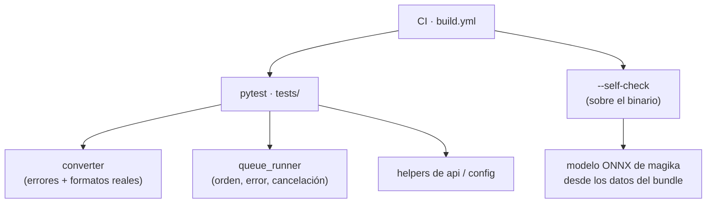

# Pruebas

La lógica se prueba con **`pytest`**; el binario empaquetado, con el flag
**`--self-check`** del ejecutable. Ambos corren en CI antes de publicar un
release.



Los tests son deterministas: generan sus propios datos en un `tmp_path` y no
tocan la red ni la ventana.

---

## Correr los tests

| Comando | Qué hace |
|---|---|
| `uv run pytest` | Toda la suíte |
| `uv run pytest -v` | Una línea por test |
| `uv run pytest tests/test_queue_runner.py` | Un archivo |
| `uv run pytest tests/test_queue_runner.py::test_cancelacion` | Un solo test |
| `uv run pytest -k cancel` | Todos los que tengan `cancel` en el nombre |
| `uv run pytest -x` | Frena en el primer fallo |
| `uv run pytest --lf` | Solo los que fallaron la última vez |

Un test **pasa** si termina sin lanzar excepción; **falla** si un `assert` da
falso o algo revienta. No hace falta registrar ni devolver nada.

---

## Estructura de `tests/`

Un `test_<módulo>.py` por módulo de `app/`, más `conftest.py` con los fixtures
compartidos. Sin `__init__.py` (pytest los descubre por nombre).

| Archivo | Cubre |
|---|---|
| `test_converter.py` | Conversión real formato por formato (texto, `ipynb`, `xlsx`, `pptx`, PDF), un PDF roto que debe dar `ConversionError`, y la traducción de cada excepción de markitdown a su mensaje en español. |
| `test_queue_runner.py` | `QueueRunner`: procesa en orden y un archivo con error no detiene la cola; cancelar deja terminar el archivo en curso y marca el resto `cancelled`; no reprocesa lo que ya estaba `done`. |
| `test_api.py` | Helpers puros de `api.py`: `_extension`, `_first_path`, `_all_paths`, `_unique_md_path`. |
| `test_config.py` | `supported_extensions()` y `file_dialog_filter()`. |

### Fixtures (`conftest.py`)

| Fixture | Da |
|---|---|
| `make_pdf` | Una función `(texto) -> bytes` que arma un PDF válido mínimo, sin depender de una librería de PDF. |
| `make_entries` | Una función `(n) -> dict` con `n` entradas de cola sintéticas ya normalizadas. |
| `run_queue` | Arranca `QueueRunner` con un `convert` falso (parchea `app.queue_runner.convert` con `monkeypatch`), recoge los eventos y permite un callback `during` entre el `start` y el `join` — así la cancelación se prueba en un punto exacto. |

Los builtin de pytest que más se usan acá: `tmp_path` (carpeta temporal por
test, se borra sola), `monkeypatch` (reemplaza algo y lo deshace al terminar),
`pytest.raises` (afirma que algo levanta una excepción), `pytest.importorskip`
(salta el test si falta una dependencia opcional).

---

## Agregar un test

Regla del proyecto: **toda funcionalidad nueva lleva test** (ver
[`CLAUDE.md`](../../CLAUDE.md)).

1. Abrí (o creá) `tests/test_<módulo>.py` para el módulo de `app/` que tocaste.
2. Escribí una función `def test_...():` con un nombre que describa el contrato,
   no el mecanismo.
3. Preparás el escenario, ejecutás, y `assert` sobre el resultado.
4. Si estás arreglando un bug: **primero** el test que reproduce el fallo (tiene
   que quedar en rojo), después el arreglo.
5. `uv run pytest` antes de commitear.

Ejemplo mínimo:

```python
def test_extension_ignora_mayusculas():
    from app.api import _extension

    assert _extension("/x/INFORME.PDF") == "pdf"
```

---

## `--self-check`

```bash
uv run python -m app.main --self-check
# o, sobre un bundle ya construido:
./dist/ToMarkdown.app/Contents/MacOS/ToMarkdown --self-check [archivo ...]
```

Convierte sin abrir la ventana. Sin argumentos usa una muestra de texto interna;
con argumentos convierte esos archivos.

Su valor está en el **binario empaquetado**: ejercita la parte frágil del
bundle, que es la carga del modelo ONNX de `magika` (la detección de tipo de
markitdown) desde los datos que empaqueta `build.spec`. Eso funciona siempre en
desarrollo y es lo que se rompe en un `.app` mal armado.

En Windows el ejecutable es de tipo ventana y no escribe en consola: ahí solo
cuenta el código de salida.

```bash
echo $LASTEXITCODE   # PowerShell
```

---

## En CI

[`.github/workflows/build.yml`](../../.github/workflows/build.yml) corre, en cada
tag `v*` y en cada runner de la matriz (`macos-latest`, `windows-latest`):

1. `uv run pytest` — antes de empaquetar.
2. `pyinstaller --noconfirm build.spec`.
3. `--self-check` sobre el binario recién construido.

Si cualquiera falla, no se publica el release.

---

Anterior: [Cambiar el icono de la app](cambiar-el-icono.md) · Siguiente: [Índice](../index.md)
