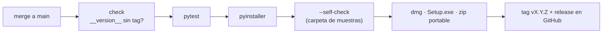

# Publicar y verificar un release

Cómo cortar un release y cómo comprobar, en una máquina sin entorno de
desarrollo, que el artefacto publicado se instala y funciona como dice el
[README](../../README.md).

---

## El modelo de ramas

- **`develop`**: integración. Todo lo nuevo entra acá (por PR).
- **`main`**: producción. Lo que está en `main` **es** el último release.

El release se dispara al mergear `develop` en `main`. No se taggea a mano: el
workflow lee `__version__` de `app/config.py` y, si todavía no existe el tag
`vX.Y.Z`, lo crea y publica. Mergear a `main` sin subir la versión no publica
nada.

---

## 1. Cortar el release

En `develop`, con la suíte en verde:

```bash
uv run pytest
uv run python scripts/bump_version.py minor     # major | minor | patch
```

`bump_version.py` sube `__version__` en `app/config.py` y hace el commit
`chore: release vX.Y.Z`. **No taggea ni pushea.**

Después, en el mismo commit:

1. Mover los cambios de `[Unreleased]` a una sección `[X.Y.Z]` con la fecha en
   [`CHANGELOG.md`](../../CHANGELOG.md), y actualizar los links del pie
   (`[Unreleased]` y `[X.Y.Z]`). `git commit --amend --no-edit`.
2. (Recomendado) dry-run de los binarios antes del PR:

   ```bash
   gh workflow run build.yml --ref develop     # o la rama release/*
   ```

   Empaqueta las dos plataformas y corre `--self-check`, sin publicar. Bajar los
   artefactos y probar la instalación en una máquina limpia (sección 2).
3. Abrir un **PR de `develop` a `main`** y mergearlo.

El merge a `main` dispara [`build.yml`](../../.github/workflows/build.yml):



> [!NOTE]
> Las notas del release salen de la sección `[X.Y.Z]` del `CHANGELOG.md` (por eso
> el paso de moverla desde `[Unreleased]` **antes** del merge), más un link
> «Changelog completo» al `compare` con el tag anterior. No se usa el
> autogenerador de GitHub.

---

## 2. Verificar en una máquina limpia

`--self-check` prueba que el bundle está completo, pero no que se instale ni que
Gatekeeper / SmartScreen se comporten como documenta el README. Eso se prueba a
mano, una vez por release, en una máquina (o VM) **sin** Python ni el repo.

Copiá el bloque de la plataforma a un comentario del issue del release y marcá
cada casilla.

### macOS

Ideal: un Mac (o VM) con **macOS 11**, que es el mínimo declarado
(`LSMinimumSystemVersion`).

- [ ] Bajar `ToMarkdown-x.y.z.dmg` desde la página de releases **con el
      navegador** (así queda con la marca de cuarentena real).
- [ ] Montar el `.dmg`: se ve `ToMarkdown.app` y el alias a `Aplicaciones`.
- [ ] Arrastrar `ToMarkdown.app` a `Aplicaciones`.
- [ ] Doble clic: aparece *«no se puede abrir porque proviene de un desarrollador
      no identificado»*.
- [ ] Clic derecho → **Abrir** → **Abrir**: la ventana abre.
- [ ] Arrastrar un `.pdf` y un `.docx` reales a la ventana y convertirlos: quedan
      en `done`.
- [ ] «Guardar todo»: el diálogo de carpeta abre y los `.md` se escriben.
- [ ] «Mostrar en el explorador» de un archivo guardado abre el Finder en su
      carpeta.
- [ ] Cerrar y reabrir con doble clic normal: ya no pide confirmación.
- [ ] En terminal:
      `/Applications/ToMarkdown.app/Contents/MacOS/ToMarkdown --self-check`
      sale con código 0.

### Windows

Ideal: Windows 11 recién instalado.

- [ ] Bajar `ToMarkdown-Setup-x.y.z.exe` con el navegador.
- [ ] Ejecutarlo: SmartScreen avisa → **Más información** → **Ejecutar de todas
      formas**.
- [ ] El instalador corre, pide elevación (UAC) e instala en Archivos de
      programa.
- [ ] Abrir **ToMarkdown** desde el menú inicio: la ventana abre.
- [ ] Convertir un `.pdf` y un `.xlsx` reales arrastrándolos a la ventana.
- [ ] «Guardar todo» y «Mostrar en el explorador» funcionan con los diálogos
      nativos.
- [ ] Desinstalar desde *Aplicaciones instaladas*: se va limpio, sin dejar la
      carpeta ni accesos.
- [ ] Aparte, probar el portable `ToMarkdown-x.y.z-portable.zip`: descomprimir y
      ejecutar `ToMarkdown.exe` sin instalar.

---

## 3. Anotar el resultado

Pegar el checklist completado como comentario en el issue del release (o en
[#4](https://github.com/YERCKEN/tomarkdown/issues/4) para la primera vuelta). Si
algún paso no salió como dice el README, corregir el README en el mismo PR que
arregle el problema.

---

Anterior: [Pruebas](pruebas.md) · Siguiente: [Índice](../index.md)
