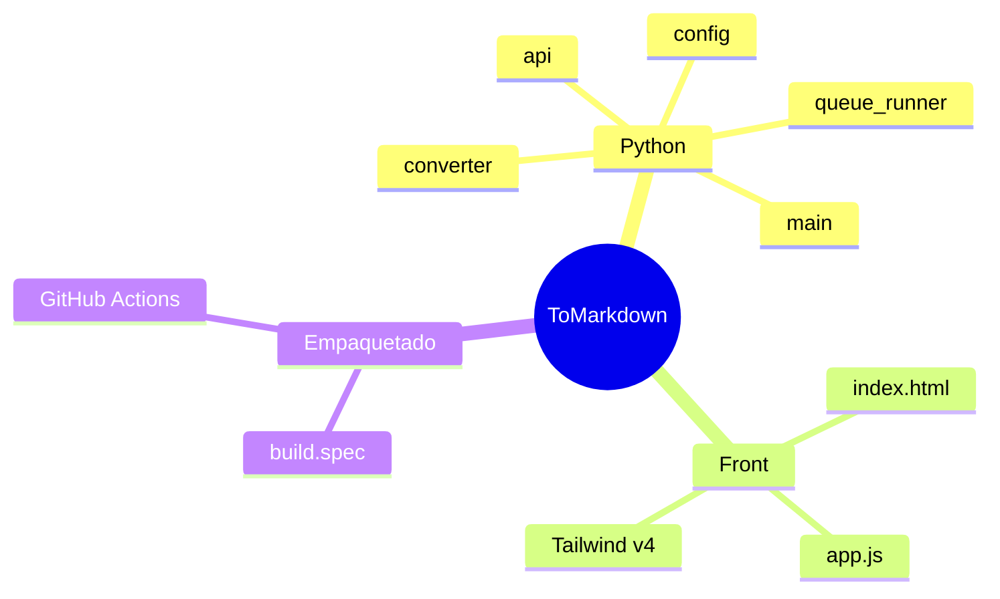

# Documentación de ToMarkdown

Documentación técnica del proyecto. Para instalar y usar la app, el punto de
entrada es el [README](../README.md).

---

## Contenido

| Página | Qué cubre |
|---|---|
| [Arquitectura](arquitectura/overview.md) | Las piezas, el modelo de hilos y por qué la conversión es serial |
| [Contrato de la API](arquitectura/contrato-api.md) | Métodos expuestos al JavaScript, eventos y forma de `FileEntry` |

---

## Mapa rápido

---

## Convenciones

- Los **encabezados** van en español; el **código, los identificadores y las
  etiquetas de los diagramas** en inglés.
- Los diagramas se escriben en **Mermaid** y se mantienen por debajo de diez
  entidades. Si uno crece, se parte en varios por dominio.
- Cada decisión no obvia se documenta con su **porqué**, no solo con el qué.

---

Siguiente: [Arquitectura](arquitectura/overview.md)
